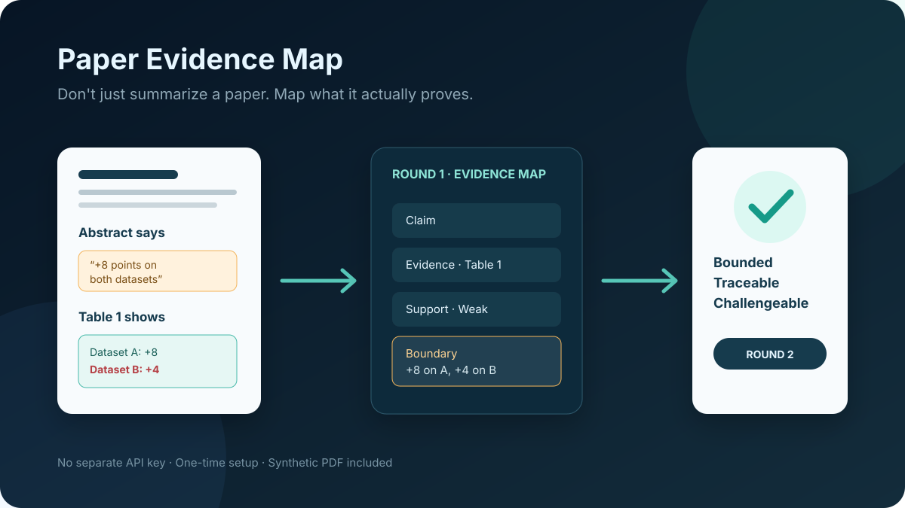

# Paper Evidence Map｜论文证据地图

> **不要只总结论文，要画出它究竟证明了什么——而且只读到当前问题真正需要的深度。**

[English](README.md) · [快速开始](docs/quickstart.zh-CN.md) · [自适应阅读](docs/adaptive-reading.md) · [路由评测](docs/evaluation-adaptive.md) · [方法说明](docs/methodology.zh-CN.md) · [已知问题](docs/known-issues.md)

Paper Evidence Map 是一套**自适应、证据优先**的科研论文阅读工作流。它不再要求每篇论文一上来都做完整深读，而是先判断你当前想从论文里得到什么，再选择能够可靠回答问题的最小阅读深度。

例如：

```text
“这篇在讲什么？”            → Scan
“适不适合我的研究方向？”      → Triage
“这个模块到底怎么工作的？”    → Targeted
“深入读这篇。”                → Deep
“严格复核主要结论。”          → Audit
```

无论深度怎么变，核心证据链不变：

```text
主张 → 证据 → 支持强度 → 可辩护边界
```

当论文内部出现值得追踪的异常或缺口时，PEM 还可以形成 **Candidate Gap / Candidate Idea**，但不会把未经验证的缺失直接包装成“新颖研究方向”。

它面向低门槛的普通 ChatGPT Chat / Project 使用，不绑定某个固定模型、模式、套餐或额度规则。

**使用条件：**需要可上传文件的 ChatGPT 账户；推荐但不强制使用 Project。主要工作流不需要单独 API Key 或安装软件包；可选本地检查器需要 Python 3.9+。



## 为什么要自适应阅读？

真实科研阅读并不是每次都从“完整审计整篇论文”开始。你可能只想知道：

- 这篇和我现在的研究有没有关系；
- 值不值得投入时间；
- 哪一节最值得先看；
- 某个模块到底怎么做；
- 某个结论是不是被实验真正支持；
- 有没有可能形成自己的研究 Idea；
- 明天要汇报，应该重点讲什么。

如果这些问题都强制先跑完整证据地图，会产生大量无关分析。

PEM v0.2 因此遵守三条核心规则：

1. **没有用户需求，就不做无关分析。**
2. **没有证据，就不下强结论。**
3. **没有验证过的 Gap，就不下强 Research Idea。**

当前目标已经满足时停止；只有当前深度不足以可靠回答时才继续升级。

## 五级阅读深度

| 深度 | 用途 |
|---|---|
| **Scan** | 快速判断论文在做什么 |
| **Triage** | 判断是否相关、值不值得读、下一步看哪里 |
| **Targeted** | 只回答一个方法、表格、实验、主张或 Idea 问题 |
| **Deep** | 建立较完整的方法/实验/主张—证据地图 |
| **Audit** | 怀疑式重新取证，尝试证伪或收窄关键结论 |

用户只上传论文但没有明确要求全文深读时，默认使用 **Triage**。

## 在 Project 中使用

如果只是使用工作流，不需要克隆仓库。

1. ChatGPT Project 优先使用 [8,000 字符限制内的专用版](prompts/zh-CN/project-instructions-chatgpt-project.md)；其他环境可选[完整版](prompts/zh-CN/project-instructions.md)，需要更短指令时使用 [Compact 版](prompts/zh-CN/project-instructions-compact.md)。
2. 新建一个 ChatGPT Project，例如 **Paper Evidence Map / 论文证据地图**。
3. 把 ChatGPT Project 专用版完整粘贴进 Project instructions。
4. 一篇论文一个 Chat，上传正文和关系明确的补充材料。
5. **直接问真实问题，不需要先发送“第一轮”。**

例如：

```text
这篇适不适合我现在的研究方向？
我主要想找可能产生论文 idea 的地方。
解释一下 Sec. 3.2 这个模块到底怎么做。
Table 4 真的能支持作者说的 robustness 吗？
我明天要给老师讲这篇，应该重点看什么？
```

ChatGPT Project 专用版不再占用字符保留旧触发词，请直接表达目标：

```text
深入读这篇论文
严格复核这个关键结论
聚焦分析 X
```

完整版和 Compact 版仍保留旧触发词兼容。

## 一个可以核对的例子

仓库中的合成论文故意让正文声称与原始表格发生冲突：

| 论文怎么说 | 原始证据怎么说 | 可辩护解读 |
|---|---|---|
| “两个数据集都提升 8 个点” | Table 1：A +8，B **只有 +4** | B 上的标题式结论被夸大 |
| “两个模块都必不可少” | Table 2：移除 C 后 **0.78 → 0.78** | C 的必要性没有得到证明 |
| “具有广泛鲁棒性” | 只在一个数据集测试一种扰动强度 | 证据只支持该测试条件 |

你可以检查[可直接上传的 PDF](examples/synthetic/paper.pdf)、[Markdown 源文](examples/synthetic/paper.md)、[8 个必找项](examples/synthetic/expected-findings.md)、[参考证据地图](examples/synthetic/expected-output.md)和[参考 JSON](examples/synthetic/expected-output.json)。

这些材料可以用于挑战方法，但不能证明每次模型运行都一定找全问题。

## Candidate Gap 与 Candidate Idea

PEM 允许在完整审计之前发现有价值的研究异常，但会严格区分状态：

```text
观察
  ↓
Candidate Gap
  ↓
Targeted Evidence Check
  ↓
Candidate Idea
  ↓
必要时做外部新颖性 / 可行性核查
  ↓
Research Idea
```

“作者没做某个实验”本身，不足以证明这是可发表创新点。

## 输出不是固定模板

Triage 可能只输出：

- 与你当前目标的相关性；
- 论文真正贡献；
- 最值得先看的章节/图表；
- 暂时可以略过的部分；
- 初步研究杠杆；
- 一个具体下一步。

Deep / Audit 才可能进一步输出：

- 来源与阅读覆盖；
- 完整技术链和模块依赖；
- 实验地图；
- 主张 → 证据 → 支持 → 边界矩阵；
- 跨章节矛盾与过度表述；
- 未知项/风险登记；
- 优先复核问题。

重要实质性判断都应该能落到真实来源位置，否则明确标记未知或不可访问。

## 运行传统证据挑战

如果你要专门测试旧版 Deep 证据地图能力：

1. 上传 [`examples/synthetic/paper.pdf`](examples/synthetic/paper.pdf)。
2. 发送“深入读这篇论文”，明确进入 Deep 路径。
3. 与[必找项](examples/synthetic/expected-findings.md)比较。
4. 使用[证据评测量表](docs/evaluation.zh-CN.md)打分。
5. 可选运行：

```bash
python scripts/validate.py --response path/to/response.md --fixture synthetic
```

## 测试自适应路由

v0.2 新增了独立路由夹具，因为一个回答即使事实都对，也可能因为“读太多、读太少、路由错误或该停不停”而失败。

参见：

- [`examples/adaptive-routing/`](examples/adaptive-routing/README.md)
- [自适应路由评测说明](docs/evaluation-adaptive.md)

先检查路由夹具本身：

```bash
python scripts/check_adaptive_routes.py
```

主要失败类型：

```text
OVERREAD
UNDERREAD
MISROUTE
NO_STOP
EVIDENCE_BYPASS
IDEA_OVERPROMOTION
```

确定性脚本只检查测试契约是否完整，不会假装能够自动判断模型语义表现；实际路由质量仍需要重复 live run 和人工评分。

## 它适合做什么

| 需求 | 是否适合 |
|---|---|
| 判断论文值不值得继续读 | **适合** |
| 只搞懂某个方法/模块/实验 | **适合** |
| 审计论文内部主张是否被证据支持 | **适合——核心能力** |
| 寻找可追溯的 Candidate Gap / Idea | **适合，但保留状态边界** |
| 建立可复核论文阅读笔记 | **适合** |
| 搜索和排序整个文献领域 | 不适合；应使用文献检索工作流 |
| 仅凭一篇论文证明领域级新颖性 | 不适合 |
| 自动重跑实验或完成统计复现 | 不适合 |
| 完成研究→实验→写作全生命周期 | 不适合；应使用更广泛科研套件 |

定位提供的是可追溯性，不是真理证明。重要科研决策仍需要人工复核。

## 架构

PEM v0.2 采用薄 Router + 按需加载，但保留自己的 Evidence Engine：

```text
SKILL.md
   ↓
manifest.yaml
   ↓
Goal Router + Depth Router
   ↓
选择必要 Lens
   ↓
source-grounded evidence work
   ↓
满足当前目标后 STOP
```

具体参考与边界见 [design reference audit](docs/design-reference-audit.md)。其中记录了哪些思想来自 Nature Skills / Academic Research Suite，哪些是 PEM 自己的核心设计。

## 仓库结构

```text
paper-evidence-map/
├── SKILL.md                 # 薄 Skill Router
├── manifest.yaml            # 加载与路由契约
├── static/core/             # 常驻原则 / 来源门 / 输出契约
├── router/                  # Goal / Depth Router
├── lenses/                  # 可组合阅读能力
├── prompts/                 # 中英文 Project 提示词
├── examples/                # 证据、安全、访问、路由评测夹具
├── schemas/                 # 机器可读证据地图 Schema
├── scripts/                 # 仓库、证据与路由检查器
└── docs/                    # 方法、快速开始、评测、设计说明
```

## 当前成熟度

这是一个仍在迭代的工作流与测试框架，不是经过验证的科学仪器。仓库中的参考输出和路由夹具属于评测材料，不是模型排行榜。

不要上传你无权处理的机密、未公开、含敏感个人信息、受限制审稿材料或其他受政策限制的内容。扫描 PDF、长文档、公式、图表和补充材料也可能存在访问不完整。

## 贡献更难的测试

最有价值的贡献不是“它很好用”，而是一个可复现失败：

- 证据失败：漏掉矛盾、伪造定位、结论边界过宽；
- 路由失败：过度阅读、阅读不足、选错 Lens、该停不停；
- Idea 失败：把未验证缺失直接升级成创新；
- 来源失败：主论文/补充材料/评审混用，或被文档内提示注入影响。

参见 [CONTRIBUTING.md](CONTRIBUTING.md)，并在提交 PR 前运行仓库检查。

## License 与引用

MIT License，见 [LICENSE](LICENSE)。如果本工作流实质性支持了正式研究或教学，可使用 [CITATION.cff](CITATION.cff)。
